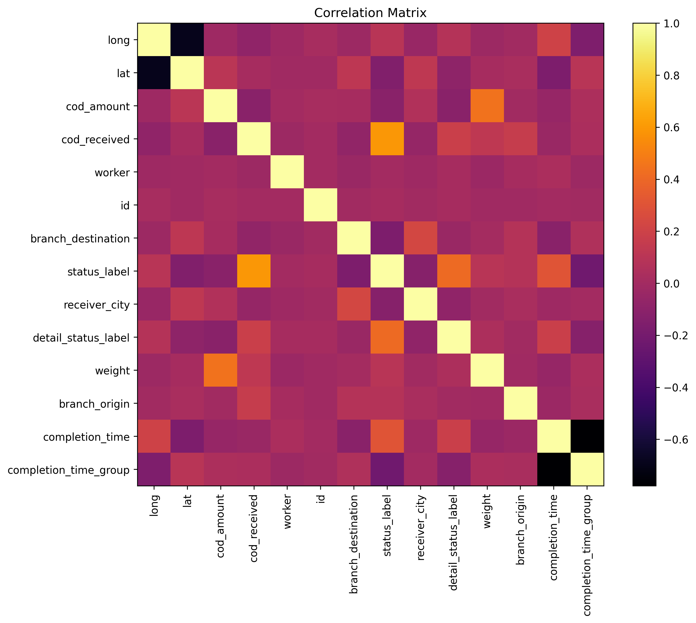
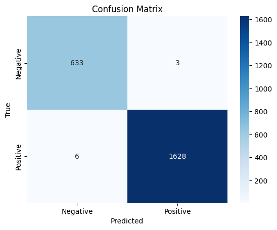
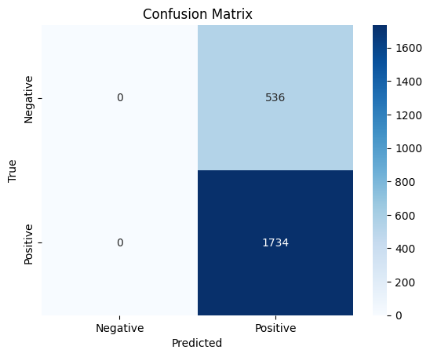

# MileApp

## Introduction

A brief description of the fields within the dataset can be seen below.

| Field                    | Description                                  |
|--------------------------|----------------------------------------------|
| taskId                   | Unique identifier for the task generated by the system. |
| taskCreatedTime          | Time at which the task was created.           |
| taskCompletedTime        | Time at which the task was completed.         |
| taskAssignedTo           | Worker assigned to perform the task.          |
| taskLocationDone         | Coordinates of where the task was completed.  |
| flow                     | Flow or type of the task.                     |
| cod                      | Contains data for the COD system.             |
| cod.amount               | Amount of money from COD.                     |
| cod.received             | Indicates whether COD has been received or not. |
| UserVar                  | Contains more specified data, in this case, it is about delivery task data. |
| UserVar.taskStatus       | Delivery status code.                         |
| UserVar.taskStatusLabel | Delivery status label.                        |
| UserVar.taskDetailStatus | Detailed delivery status code.                |
| UserVar.taskDetailStatusLabel | Detailed delivery status label.           |
| UserVar.branch_origin    | Branch code of the origin.                    |
| UserVar.branch_dest      | Branch code of the destination.               |
| UserVar.weight           | Weight of the package.                        |


The json structure can be seen below.

```json
{
    "taskLocationDone": {
        "lon": 109.7629103,
        "lat": -6.9266078
    },
    "taskCreatedTime": "2022-11-01 20:17:26 +0700",
    "cod": {
        "amount": 685000,
        "received": true
    },
    "taskAssignedTo": "pacifiedLion0",
    "taskCompletedTime": "2022-11-01 20:46:30 +0700",
    "taskStatus": "done",
    "flow": "Delivery",
    "taskId": "4fe3b237c832ca4841a2",
    "UserVar": {
        "branch_dest": "SRG",
        "taskStatusLabel": "Success",
        "receiver_city": "BATANG ,KAB BATANG",
        "taskDetailStatusLabel": "YANG BERSANGKUTAN",
        "taskDetailStatus": "D01",
        "weight": "13",
        "branch_origin": "CGK",
        "taskStatus": "COLF01"
    }
}
```

For ease of analysis, i decided to flatten the data structure using [json-roller](https://github.com/xitiomet/json-roller).

After it was flattened to .csv format, we can start exploring the data.

Initially, the objective was to do a task completion time prediction, which is a regression problem. However, after carefully exploring the dataset, it appears that this dataset alone is not sufficient. I ended up performing a regression testing to confirm that i was right.

Given the insights gained from the regression testing, it was determined that we should move to classification problems. The key question then became: what specific problem could be addressed based on the limited dataset available?


1. Delivery Status Prediction. 

This problem involves predicting whether a task will result in successful or failed delivery based on various contextual factors, which will be explained later in the Machine Learning section. By predicting the delivery status, we can help identify potential issues or delays in the delivery process. If optimized, this can lead to cost savings and better resource management.

2. Completion Time Prediction. 

This problem centers around accurately classifying tasks into two groups: those expected to be completed within two hours and those anticipated to take longer. By predicting the completion time, businesses can better assign tasks to workers based on their availability and efficiency. If optimized, we can ensure that tasks are allocated to workers who can complete them within the desired time frame, thereby ensuring compliance with the predefined Service Level Agreement, such as "delivery within 2 hours" SLA.

## Data Exploration and Cleaning

I began by using `data.info()` to display the dataset summary. Mainly for looking at the field datatypes and looking whether theres a null value or not. To complement, `data.isnull().sum()` was also used.

Then i proceed by using both `data.head()` and `data.tail()` for verifying that the data has been processed correctly by [json-roller](https://github.com/xitiomet/json-roller).

For convenient, i decided to rename the dataset.


| Original Field Name       | Renamed Field Name |
|--------------------------|--------------------|
| taskId                   | id                 |
| taskCreatedTime          | task_created_time  |
| taskCompletedTime        | task_completed_time|
| taskAssignedTo           | worker             |
| taskLocationDone         | location_done      |
| flow                     | flow               |
| cod                      | cod                |
| cod.amount               | cod_amount         |
| cod.received             | cod_received       |
| UserVar                  | user_var           |
| UserVar.taskStatus       | status_code        |
| UserVar.taskStatusLabel | status_label       |
| UserVar.taskDetailStatus | detail_status_code |
| UserVar.taskDetailStatusLabel | detail_status_label|
| UserVar.branch_origin    | branch_origin      |
| UserVar.branch_dest      | branch_destination |
| UserVar.weight           | weight             |

The data preprocessing steps included dropping the variables `flow` and `task_status` as they had only one unique value, indicating they provided no useful information. Similarly, the variables `detail_status` and `status` were dropped as they were redundant, with their information already captured in `detail_status_label` and `status_label` respectively.

A new variable named 'completion_time' was created by calculating the time difference between `task_completed_time` and `task_created_time`. This variable captures the duration it took for a task to be completed.

Furthermore, a new categorical variable called `completion_time_group` was derived from `completion_time`. This variable classifies the completion time into two groups: 'within 2 hours' and 'over 2 hours'. This binning process helps to categorize tasks based on their completion time, providing a simplified view of task durations.

## Machine Learning

Before feeding the data into the machine learning model, a preprocessing step called label encoding is performed. Label encoding is used to convert categorical variables into unique numerical representations, enabling the model to process them effectively.

The following fields (furthermore will be referred as variables) with object data types underwent the label encoding process: `cod_received`, `worker`, `id`, `branch_destination`, `status_label`, `receiver_city`, `detail_status_label`, `branch_origin`, and `completion_time_group`.

After underwent such process, the fields are transformed into numerical representations, as shown below:

| cod_received | worker | id   | branch_destination | status_label | receiver_city | detail_status_label | branch_origin | completion_time_group |
|--------------|--------|------|--------------------|--------------|---------------|---------------------|---------------|-----------------------|
| 1            | 1843   | 2403 | 50                 | 1            | 137           | 30                  | 12            | 1                     |

Next, a correlation matrix is generated based on the processed data.



Based on the correlation matrix, certain variables shows a relatively moderate correlation, although some show weak corelation, but nonetheless i will select these variables for the machine learning model.

For Delivery Status Prediction, the fields `cod_received`, `detail_status_label`, and `completion_time` show correlations of 0.594, 0.411, and 0.307, respectively.

For Completion Time Prediction, the variables `detail_status_label` and `status_label` show correlations of -0.124 and -0.219, respectively.

I will be using the Random Forest Classifier for both problems.
The dataset will be split into a 7:3, meaning 70% dataset will be allocated to the training set, and the rest 30% will be allocated to the testing set.

Both model and dataset will undergo GridSearchCV, to find the most optimal parameter.

## Delivery Status Prediction

| Metric     | Train Score | Test Score |
|------------|-------------|------------|
| Accuracy   | 1.000       | 0.996       |
| Precision  | 1.000        | 0.998       |
| Recall     | 1.000       | 0.996     |
| F1 Score   | 1.000        | 0.997       |

This model performed well, the test score is near-perfect. These high scores can be attributed to the careful selection of variables that have moderately good correlations with the delivery status. By choosing the right variables, we were able to include important information thats significant.



As for the confusion matrix, the model incorrectly predicted 3 data as successful delivery when they were actually a failed delivery, and 6 data as failed delivery when they were actually a succesful delivery. And these numbers are great, because we could confidently minimize unnecessary expenses and prioritized other task/delivery, as i have explained in the introduction.


## Completion Time Prediction

| Metric     | Train Score | Test Score |
|------------|-------------|------------|
| Accuracy   | 0.765       | 0.764       |
| Precision  | 0.765        | 0.764       |
| Recall     | 1.000       | 1.000     |
| F1 Score   | 0.867        | 0.866       |

It is important to note that the correlation coefficients for the variables `detail_status_label` and `status_label` are relatively weak, with values of -0.124 and -0.219, respectively. This suggests that these variables have a limited impact on predicting completion time and reflected in all these metrics.



It is interesting and worth mentioning, that this model successfully predicting 1734 data as positive ('within 2 hours') but it failed terribly predicting 536 data as negative ('over 2 hours').

Overall, the Completion Time Prediction model shows acceptable performance, but could benefit from additional features that did not exist yet in this particular dataset. 

# Conclusion
In summary, the Delivery Status Prediction model demonstrated excellent performance, benefiting from the selected variables with moderate correlations. On the other hand, the Completion Time Prediction model showed acceptable but room for improvement results, with the need to explore more influential variables.


---

Refer to [Jupyter Notebook](https://github.com/rizkilaks/mileapp/blob/main/data_svm_clean.ipynb) for more technical stuff.

